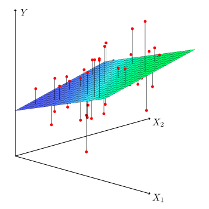
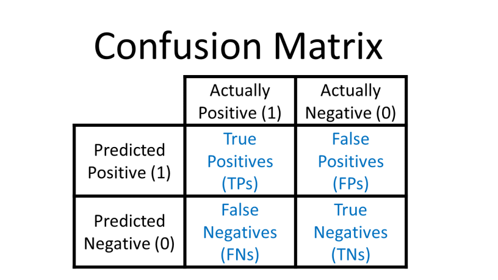

Linear regression = fitting a line on our data to predict y from x.

Multiple regression:

Same as linear regression, but with multiple independent variables.

$y = ax_1 + bx_2 + ... + cx_n + d$

where $x_1, x_2, ... , x_n$ are the features (X).

Eg: Predicting exam scores using hours studied, IQ and attendance.

# Logistic regression

used for classification

Gives output: Probability (between 0 and 1).

> Sigmoid function: $\sigma(z) = \frac{1}{1 + e^{-z}}$

Probability $
P(Y | X) = \frac{1}{1 + e^{ax_1 + b x_2 + ... + cx_n + d}}
$

#

# ROC graph

It plots FPR and TPR using a different thresholds.

$
\text{True Positive Rate} 
= \frac{TP}{TP + FN}
= \frac{\text{Predicted Cancer and have cancer}}{\text{Total Cancers}}
$

$
\text{False Positive Rate} 
= \frac{FP}{FP + TN}
= \frac{\text{Predicted Cancer but Healthy}}{\text{Total Healthy}}
$

AUC = Area under the curve; More area is desired
